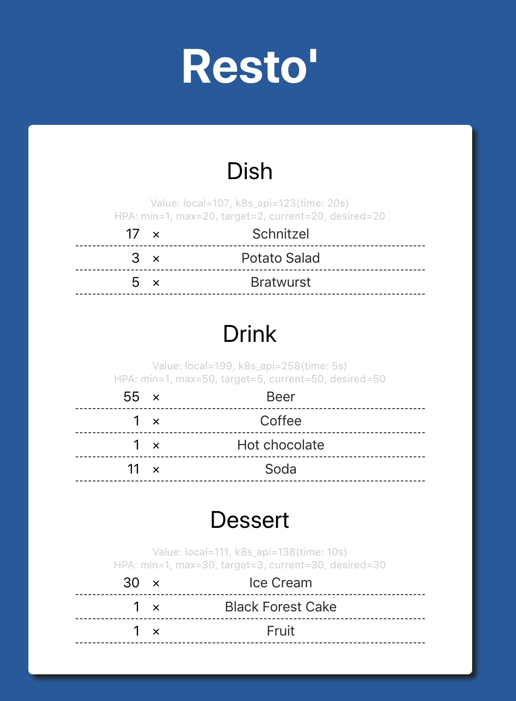

`resto-demo-app`
================

## Overview

This application was made to demonstrate some Kubernetes features, for example the way we can auto-scale deployments.

Here you can see how the application looks like:

It's a menu card, where you can order three types of products: dishes, drinks and desserts.

## Architecture

The architecture of the application is not so complex. It is composed of:
  - a redis database, to store tasks in lists for each queues;
  - three types of workers, one for each type of queue;
  - backend: written in NodeJS, it will expose metrics and is the part the frontend part will speak with
  - frontend: uses ReactJS to make a simple interface (the one you can see on the screenshot above), to speak with the backend (essentially to add new tasks in queues and get the state of the global application)

